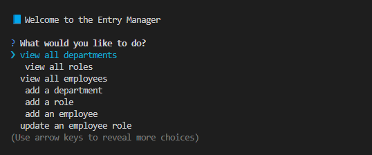

# 10-Challenge

## Description

This is the module 10 assignment. The assignment this week is to build a command-line application from scratch to manage a company's employee database, using Node.js, Inquirer, and PostgreSQL.

## Installation

All that is needed is running npm i

## Usage

First you will need to run the following commands:
npm run build
npm start

After that the application will start and you will have multiple options to chose from: view all departments, viewe all roles, view all employees, add a department, add a role, add an emplyee, and update an employee. From this point you will just work through the application either viewing, adding or updating and exit once you are complete.

[This is a video of the app working](https://drive.google.com/file/d/13z0J5jTv2dtWOyTM1rOrT4mKY-xrXJ0i/view?usp=sharing)
